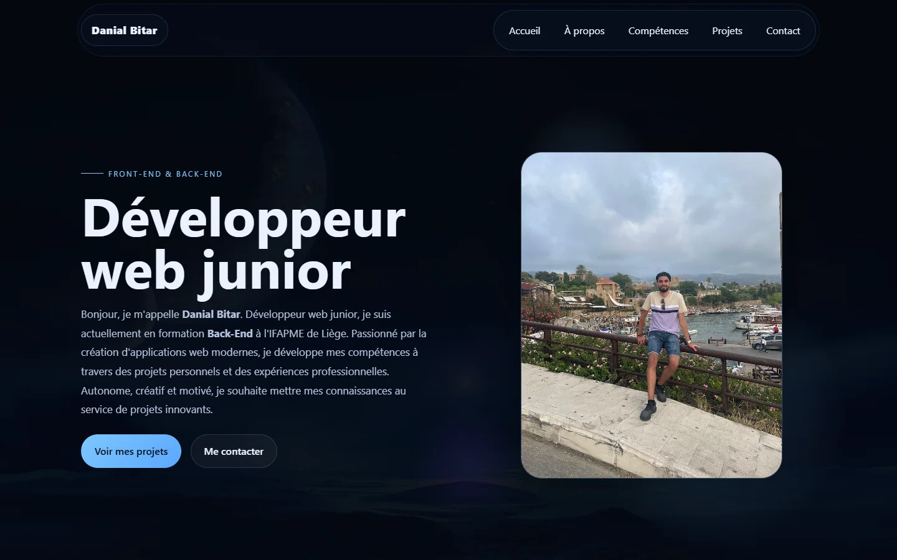

# 👋 Danial Bitar — Portfolio

**Développeur web junior, front-end & back-end, en formation Back-End à l'IFAPME de Liège.**

🔗 **[danidois2002.github.io/portfolio](https://danidois2002.github.io/portfolio/)**

---

## 🗂️ Ce que contient le portfolio

- **À propos** : langues, centres d'intérêt, expériences professionnelles et formations
- **Compétences** : langages, outils et logiciels
- **Projets** : mes réalisations, avec un lien vers chacune
- **Contact** : formulaire qui prépare un e-mail, et mes réseaux

## 🚀 Projets présentés

| Projet | Description | Lien |
|---|---|---|
| **GymSocial** | Application mobile de fitness (React Native, Expo, Node.js, Supabase) | [gymsocial.eu](https://www.gymsocial.eu) |
| **¡Hala Madrid!** | Site de supporters avec boutique et configurateur de maillot en SVG | [Démo](https://danidois2002.github.io/HalaMadrid/) · [Code](https://github.com/Danidois2002/HalaMadrid) |
| **Daniel's Pizzeria** | Site vitrine avec carte interactive et réservation | [Démo](https://danidois2002.github.io/Pizzeria/) · [Code](https://github.com/Danidois2002/Pizzeria) |
| **Diagnostic Supply Chain** | Quiz de maturité réalisé pendant mon stage chez Logistics in Wallonia, devenu full-stack (React, Node.js, PostgreSQL) avec espace admin | [Démo](https://danidois2002.github.io/diagnostic-supply-chain/) · [Code](https://github.com/Danidois2002/diagnostic-supply-chain) |

## 🛠️ Côté technique

- HTML, CSS et JavaScript natifs, sans framework
- Animations au scroll avec `IntersectionObserver` et parallax optimisé (rendu fluide, sans recalculs de mise en page)
- Mise en page responsive, du téléphone à l'écran large

## 📫 Me contacter

[LinkedIn](https://www.linkedin.com/in/daniel-bitar-992ab3258) · [GitHub](https://github.com/Danidois2002) · [Instagram](https://www.instagram.com/dbitar_/) · dbitar77@gmail.com
